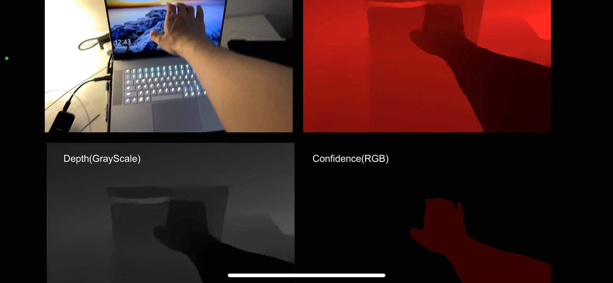

# IOS-LiDAR-Transission-Unity

# Basic Setup #

MQTT address, port and topic (temporaly) for accessing the byte of the depth image present below.

Address: mqtt.fluux.io

Port: 1883

Topic: jie/guan

Use this project to test the receiving in Unity.

https://github.com/jieguann/Unity-Image-Transmission

The depth image will be a greyscale depth image.

Unity Lidar Depth Image class including method to get the depth image of the environmetn and human.

## Reference ##

https://docs.unity3d.com/Packages/com.unity.xr.arfoundation@4.1/api/UnityEngine.XR.ARFoundation.AROcclusionManager.html

Great Tutorials for accessing depth map

https://www.andreasjakl.com/visualize-ar-depth-maps-in-unity-part-5/

Takashi Yoshinaga Vertices Example

https://github.com/TakashiYoshinaga/iPad-LiDAR-Depth-Sample-for-Unity
